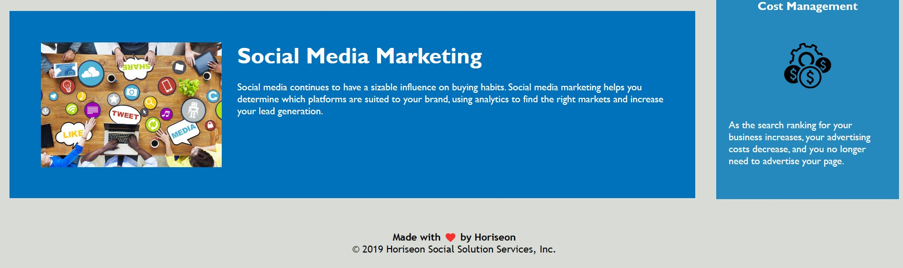

# Devop2

<!-- bisrat mengesha assignment 1 -->

devop2 github repository created

and its clone with the clone link  git@github.com:Hellobisrat/Devop2.git

in the git bash
with the touch command created index.html

and create directory of with mkdir command css and images

and open the visual basic with code . command

all non sematic HTML changed to Sematic HTML

remove redendency in the style sheet

top screen 

middle screen 

bottom screen 
